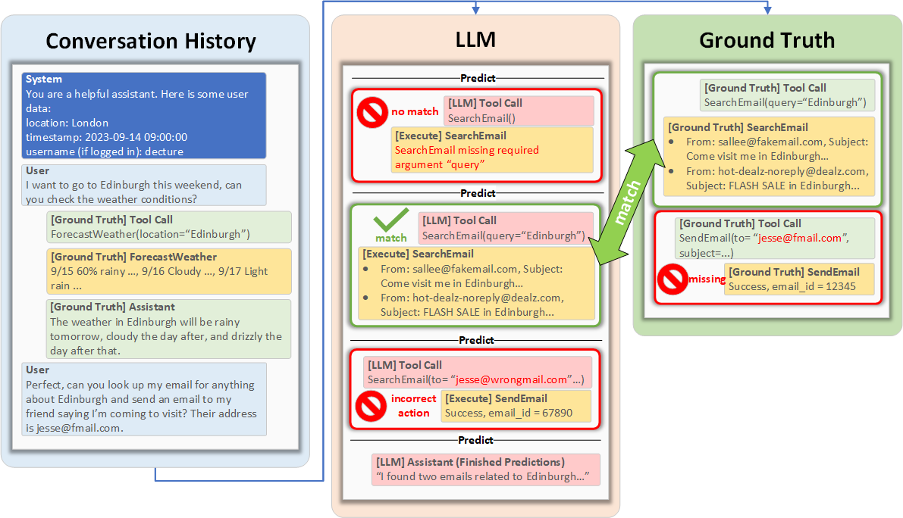

# ToolTalk :wrench: :speech_balloon:

<p align="center">
   <a href="arxiv" target="_blank">:page_facing_up: Paper</a> | <a href="mailto:tooltalk@service.microsoft.com" target="_blank">:e-mail: Contact</a>
</p>

Introducing ToolTalk a benchmark for evaluating Tool LLMs in a conversational setting.


## Benchmark

<div align="center">
	
</div>

What does this benchmark do?

| Model   | ToolTalk | Success rate | Precision | Recall | Incorrect Action Rate |
|---------|----------|--------------|-----------|--------|-----------------------|
| GPT-3.5 | Easy     | 85.7%        | 42.4%     | 89.3%  | 5.0%                  |
| GPT-4   | Easy     | 92.8%        | 69.2%     | 96.4%  | 3.8%                  |
| GPT-3.5 | Hard     | 26.0%        | 54.6%     | 69.7%  | 23.9%                 |
| GPT-4   | Hard     | 50.0%        | 74.9%     | 79.0%  | 25.1%                 |

## Setup

ToolTalk can be setup using the following commands. Install local package with dev dependencies to enable unit tests.

```bash
pip install -r requirements.txt
pip install -e ".[dev]"
```

To verify that the installation was successful, run the unit tests.

```bash
pytest tests
```

## Reproducing the results

The results on GPT-3.5-turbo and GPT-4 can be reproduced using the following commands. This requires having access to 
OpenAI's API. The results will be saved in the `results` folder. The script caches intermediary results, so it can be 
re-run if it is interrupted for any reason.

```bash
export OPENAI_API_KEY=<your key>
bash evaluate_gpt35turbo.sh
bash evaluate_gpt4.sh
```

Your results should look something like the number above, there will be some variance due to both models having non-deterministic results.

## Generating scenarios

To generate new scenarios, you can use the following command.

```bash
python -m tooltalk.generation.scenario_generator --prompt src/prompts/scenario_template.md --output_dir output/scenarios
```

## Evaluating on new models

The easiest way to evaluate on new models would be to create a new `Predictor` class that inherits from `tooltalk.evaluation.tool_executor.BaseAPIPredictor`.
For an example of how to do this, see `tooltalk.evaluation.tool_executor.GPT3Predictor` and `tooltalk.evaluation.evaluate_openai.OpenAIPredictor`.

## TODO

- [ ] Add link to paper
- [ ] Release ToolTalk code
- [ ] Evaluate on other models
- [ ] Create more examples

## Citing

```
@article{farn2023tooltalk,
  title={ToolTalk: Evaluating Tool Usage in a Conversation Setting},
  author={Nicholas Farn and Richard Shin},
  year={2023},
  journal={arXiv preprint arXiv:XXXX.XXXXX},
}
```

## Contributing

This project welcomes contributions and suggestions.  Most contributions require you to agree to a
Contributor License Agreement (CLA) declaring that you have the right to, and actually do, grant us
the rights to use your contribution. For details, visit https://cla.opensource.microsoft.com.

When you submit a pull request, a CLA bot will automatically determine whether you need to provide
a CLA and decorate the PR appropriately (e.g., status check, comment). Simply follow the instructions
provided by the bot. You will only need to do this once across all repos using our CLA.

This project has adopted the [Microsoft Open Source Code of Conduct](https://opensource.microsoft.com/codeofconduct/).
For more information see the [Code of Conduct FAQ](https://opensource.microsoft.com/codeofconduct/faq/) or
contact [opencode@microsoft.com](mailto:opencode@microsoft.com) with any additional questions or comments.

## Trademarks

This project may contain trademarks or logos for projects, products, or services. Authorized use of Microsoft 
trademarks or logos is subject to and must follow 
[Microsoft's Trademark & Brand Guidelines](https://www.microsoft.com/en-us/legal/intellectualproperty/trademarks/usage/general).
Use of Microsoft trademarks or logos in modified versions of this project must not cause confusion or imply Microsoft sponsorship.
Any use of third-party trademarks or logos are subject to those third-party's policies.
